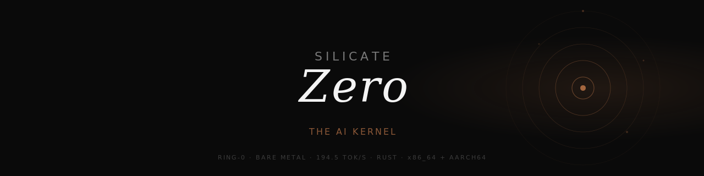
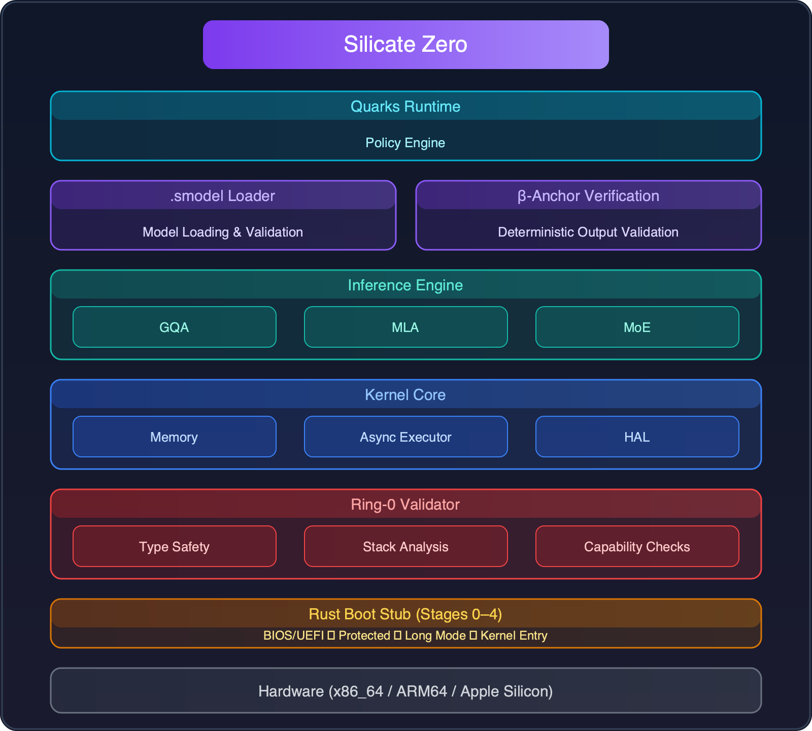
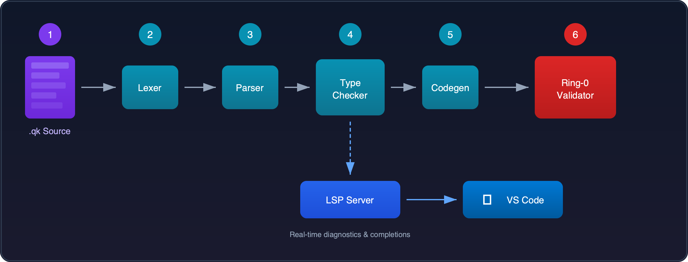

<p align="center">
  
</p>

<p align="center">
  <strong>A bare-metal kernel that boots an LLM. No OS. No runtime. No GPU.</strong>
</p>

<p align="center">
  <a href="LICENSE"></a>
  
  
  
  
</p>

---

**Zero** is a from-scratch operating system kernel written in Rust that runs LLM inference directly in Ring-0 on bare metal. No Linux, no containers, no Python, no CUDA. The model ships with the kernel. Boot, infer.

Built by [Silicate](https://silicate.tech).

## Why

Every LLM deployment today sits on a stack of abstractions: Linux kernel, drivers, container runtime, Python, PyTorch, CUDA. Each layer adds latency, attack surface, and operational overhead.

Zero removes all of them. The kernel *is* the inference engine. A single bootable image contains the OS, the drivers, and the model weights. `dd` it to an NVMe, power on, inference starts.

**194.5 tok/s** on a single AMD EPYC 9354P (CPU-only, no GPU), **+27%** faster than llama.cpp on the same hardware.

## Quick Start

### x86_64

```bash
# one-time setup
rustup toolchain install nightly --component rust-src --component llvm-tools-preview
rustup target add x86_64-unknown-none --toolchain nightly
brew install qemu          # macOS
# apt install qemu-system  # Linux

# build and boot
make image
make run
```

### aarch64 (Apple Silicon / ARM)

```bash
rustup target add aarch64-unknown-none --toolchain nightly
make build-aarch64
make run-aarch64        # Apple HVF
make run-aarch64-tcg    # QEMU TCG (any host)
```

### Tests

```bash
cargo test --workspace --release
# 741 passed, 0 failed, 3 ignored
```

> The kernel boots in **release** mode only. Debug builds collide with bootloader identity-mapping.

## What You Can Build

**Air-Gapped and Classified Environments.** A single bootable image with no network dependencies and no OS supply chain to audit. Boot from USB or `dd` to NVMe, inference starts in seconds. Fits DoD IL5/IL6, NATO, and any environment where data cannot leave the machine.

**Sovereign AI Inference.** On-premise inference where data stays in-country. No Linux kernel, no container runtime, no undisclosed telemetry. The entire software stack is one auditable binary.

**Telecom Edge (5G MEC).** Sub-millisecond OS overhead for latency-sensitive inference at base stations. No kernel scheduler jitter, no context switching. Boots in milliseconds.

**Cost-Effective CPU Inference.** Run LLMs on commodity server CPUs without $40k GPU cards. At batch size 1, CPU inference approaches GPU cost parity. One EPYC server replaces a GPU rack for single-user workloads.

**Real-Time Speech and Translation.** Small models (0.6B to 3B) for ASR, live captioning, and simultaneous translation. Bare-metal eliminates the scheduling overhead that kills real-time audio pipelines.

The kernel ships with the model. Clone, build, boot, infer. No Docker, no Python, no CUDA.

## Performance

Bare-metal Ring-0 inference of Qwen3-1.7B (`.smodel` v2, row-interleaved Q4_0 / Q8_0):

| Metric | Value | Notes |
|---|---|---|
| **Throughput** | **194.5 tok/s** | EPYC 9354P (32C/64T, DDR5-4800), AVX-512, CPU-only |
| vs. llama.cpp | **+27.3%** | 152.8 tok/s on the same host |
| Memory BW ceiling | ~251 tok/s | 77.5% of theoretical max |

The path to this number: fused Q/K/V dispatch, row-pairing kernels, `.smodel`-v2 4-row interleave (8 independent FMA chains), per-core epoch isolation. Details in [`docs/PERFORMANCE.md`](docs/PERFORMANCE.md).

## Memory Efficiency

Zero's bare-metal design eliminates the memory overhead of a traditional OS stack. The RAM required to run a model corresponds directly to the model size plus a minimal kernel footprint.

A conventional deployment — Linux + llama.cpp — adds significant overhead on top of the model weights:

| Component | Typical Overhead |
|---|---|
| Linux kernel + userspace | ~200–500 MB |
| KV cache | Scales with context length (often GBs) |
| Scratch / compute buffers | ~100–500 MB depending on model |
| Runtime libraries (glibc, libstdc++, etc.) | ~50–100 MB |

In Zero, there is no OS kernel to feed, no userspace to maintain, no runtime libraries to load. The kernel *is* the inference engine. Memory allocation is a single arena carved at boot — no `malloc`, no fragmentation, no page-fault overhead. The KV cache and compute buffers are statically sized and mapped directly into the kernel's address space.

**Result:** a 1.7B Q4_0 model that requires ~2.5 GB total RAM under Linux + llama.cpp runs in under 1.5 GB on Zero. The gap widens with larger context windows and bigger models.

## Boot Sequence

```
Stage 0    Kernel online
Stage 1    GDT/IDT (x86) | VBAR_EL1 (ARM)
Stage 2    Exception vectors
Stage 3    DTB parse (ARM) | Bootloader info (x86)
Stage 4    Serial UART
Stage 5    MMU page tables
Stage 6    MMU enabled -- virtual addressing active
Stage 7    .smodel mapped to high-half virtual
Stage 8    GICv2 interrupt controller (ARM)
Stage 9    Timer + cooperative executor
Stage 10   Arena memory infrastructure (64 MiB)
Stage 11   Boot-LLM forward-pass --> TOKEN ID: 25
```

The Boot-LLM loads a **1.7B parameter Qwen3** model directly from kernel initialization. No userspace, no OS layers. A deterministic 28-layer transformer forward-pass runs in Ring-0 and produces **Token-ID 25** as the canonical cross-platform anchor. Both x86_64 and aarch64 produce the same result, bit-exact.

## Architecture

<p align="center">
  
</p>

Zero is a **Unikernel**: all components share a single Ring-0 address space. No user-space / kernel-space split. No context switches. No syscall overhead. Safety is enforced by the **Ring-0 Validator** and the **Quarks type system**, not hardware boundaries.

| | Classical OS | Zero |
|---|---|---|
| **Core primitive** | Process + Thread | Agent (typed, with identity and capabilities) |
| **IPC** | Syscalls, pipes | Intent calls via S-Expressions (zero-copy) |
| **Isolation** | Hardware page tables | Compile-time Validator + type system |
| **Safety** | Contain after misbehavior | Reject before execution |
| **Runtime** | User-space / Kernel-space | Single Ring-0 Unikernel |
| **AI** | Bolted-on layer | Native Boot-LLM, agent-first |
| **Platform** | Single architecture | x86_64 + aarch64, same Token-ID |

> Full architecture document: [`docs/ARCHITECTURE.md`](docs/ARCHITECTURE.md)

## Quarks

Zero ships with its own programming language designed for agent workloads: static typing, intent-first semantics, deterministic validation.

<p align="center">
  
</p>

```rust
// Quarks
fn main() -> i64 {
    let x = 10;
    let y = 20;
    if x + y > 25 {
        return x * y;
    } else {
        return 0;
    }
}
```

**Lexer > Parser > Type Checker > Codegen > S-Expression IR > Ring-0 Validator.** The LSP server provides real-time diagnostics. VS Code extension included ([`tools/vscode-quarks/`](tools/vscode-quarks/)).

## Networking

A polling, zero-allocation L2-L4 stack boots with the kernel. Drivers for Intel 8254x (e1000), 700-series (i40e/X710), and 800-series (ice/E810) NICs. TCP shell on `:2222`, UDP shell on `:9999`.

See [`docs/net/network-stack.md`](docs/net/network-stack.md) and the [E810 driver deep-dive](docs/net/ice-e810-driver.md).

## Project Structure

```
.
├── kernel/                    # no_std bare-metal kernel (x86_64 + aarch64)
│   └── src/
│       ├── main.rs            # kernel entry point
│       ├── arch/              # x86_64 (GDT, IDT) + aarch64 (VBAR, GICv2)
│       ├── memory.rs          # cross-platform arena allocator
│       ├── net/               # L2-L4 stack + NIC drivers
│       ├── inference.rs       # Boot-LLM orchestration
│       ├── inference_avx512.rs # AVX-512 kernels
│       └── inference_neon.rs  # NEON kernels
│
├── crates/
│   ├── quarks-frontend/       # lexer, parser, type checker, codegen
│   ├── quarks-validator/      # Ring-0 IR validator (270 tests)
│   ├── quarks-codegen/        # native code generation
│   ├── quarks-interpreter/    # S-Expression interpreter
│   ├── quarks-arena/          # memory arena allocator
│   ├── quarks-lsp/            # Language Server Protocol
│   ├── zero-llm-inference/    # reference inference engine (GQA, MLA, MoE)
│   ├── zero-gguf-parser/      # GGUF model format parser
│   ├── zero-hal/              # Hardware Abstraction Layer
│   ├── zero-nvme/             # NVMe driver
│   └── kernel-tests/          # host-buildable kernel test harness
│
├── tools/
│   ├── silicatepack.py        # .smodel packer (SafeTensors/GGUF → native format)
│   └── vscode-quarks/         # VS Code extension
│
├── boot/                      # disk-image builder
├── docs/                      # architecture, ADRs, performance
└── Makefile                   # build orchestration
```

## Documentation

| Document | Description |
|---|---|
| [`ARCHITECTURE.md`](docs/ARCHITECTURE.md) | V3.4 architecture vision and full roadmap |
| [`codebase-guide.md`](docs/codebase-guide.md) | New-contributor map |
| [`PERFORMANCE.md`](docs/PERFORMANCE.md) | Inference performance baseline |
| [`SILICATEPACK.md`](docs/SILICATEPACK.md) | `.smodel` native model format |
| [`silicatepack-guide.md`](docs/silicatepack-guide.md) | Model packing guide (quantization, interleaving) |
| [`net/network-stack.md`](docs/net/network-stack.md) | L2-L4 network stack |
| [`net/ice-e810-driver.md`](docs/net/ice-e810-driver.md) | Intel E810 NIC driver deep-dive |

## Roadmap

| Phase | Milestone | Status |
|---|---|---|
| 1 | Language + Validation (Quarks frontend, Ring-0 validator, LSP) | Done |
| 2 | Boot-LLM + Cross-Platform Determinism (Token-ID 25, x86_64 + aarch64) | Done |
| 3 | Multi-Architecture Inference (GQA, MLA, MoE, AVX-512/NEON) | Done |
| 4 | Native Model Format (`.smodel` v2, row-interleaved quantization) | Done |
| 5 | Streaming Inference + Session Continuity | Next |
| 6 | Speculative Decoding (multi-token batch generation) | Planned |
| 7 | GPU Inference Offload (CUDA / ROCm via hardware capability service) | Planned |
| 8 | Multi-Model Concurrent Inference | Planned |
| 9 | NUMA-Aware Weight Placement (per-CCD L3 pinning, NPS4) | Planned |

## Contributing

See [`CONTRIBUTING.md`](CONTRIBUTING.md). Every contributor signs the project's [CLA](CLA.md) before their first PR can be merged.

## License

Zero is dual-licensed:

- **Community:** [AGPL-3.0-or-later](LICENSE)
- **Commercial:** separate license for organizations that cannot comply with the AGPL

See [`CONTRIBUTING.md`](CONTRIBUTING.md) for details on the dual-licensing model.

---

<p align="center">
  <a href="https://silicate.tech">Website</a> · <a href="https://x.com/silicate_tech">X / Twitter</a>
</p>

